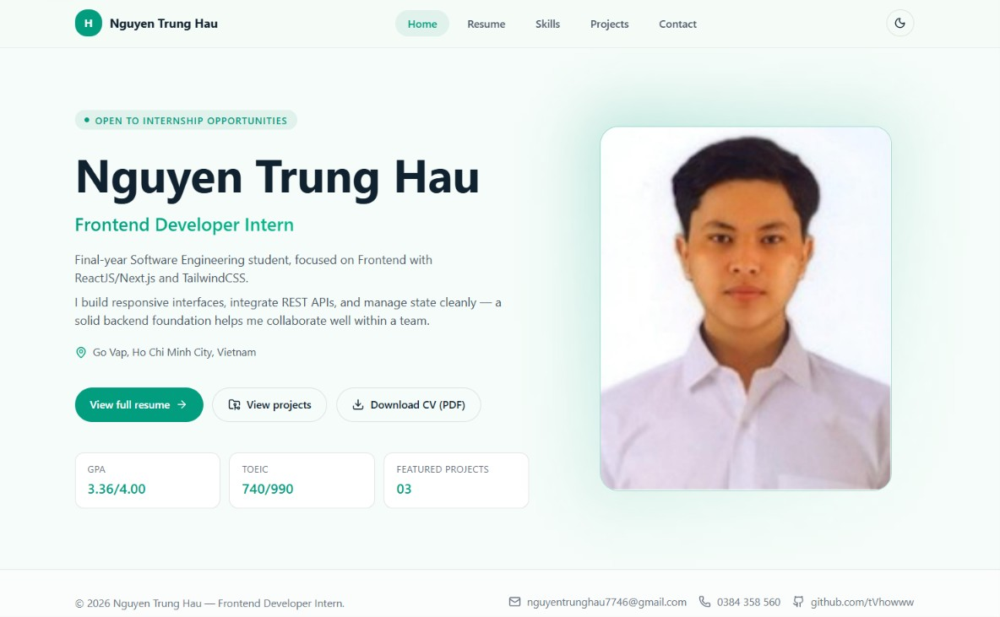
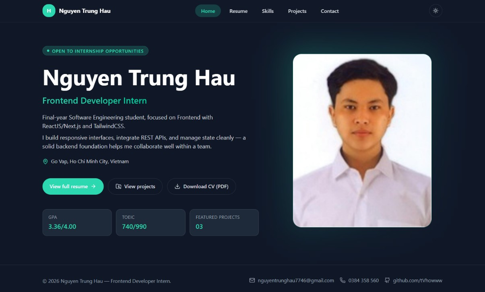
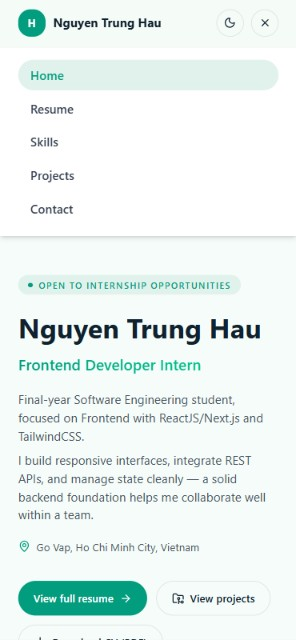

# Personal Portfolio Website

This is a personal portfolio website built for the Frontend Developer Intern technical assessment.

## 🚀 Tech Stack
- **Framework:** React.js (v19) + Vite
- **Routing:** React Router v7
- **Styling:** Tailwind CSS v4
- **Animation:** Framer Motion
- **Icons:** Lucide React
- **Code Quality:** ESLint, TypeScript

## ⚙️ Getting Started & Installation

1. **Clone the repository:**
   ```bash
   git clone https://github.com/tVhowww/hau-portfolio.git
   cd hau-portfolio
   ```

2. **Install dependencies:**
   ```bash
   npm install
   ```

3. **Run the development server:**
   ```bash
   npm run dev
   ```

4. **Open in browser:**
   Navigate to `http://localhost:5173` (or the URL provided in your terminal).

## ✨ Features Implemented
- **Routing & Transitions:** 
  - Smooth Single Page Application (SPA) experience using `react-router-dom`.
  - Elegant page transitions powered by Framer Motion.
  - Active state indication for navigation links.
  - Custom 404 Not Found fallback page.
  - Automatic `ScrollRestoration` when navigating between routes.
- **Responsive UI & Dark Mode:**
  - Fully responsive layout across Mobile, Tablet, and Desktop.
  - Complete Dark/Light mode implementation using a custom Lovable design system palette.
  - Interactive hamburger menu for mobile navigation.
  - Floating "Back to Top" button that appears on scroll.
- **Projects (Data-driven):**
  - Projects are rendered dynamically from a JSON/JS data file.
  - Integrated filtering by technology tags and searching by project name.
  - Custom UI for missing live demos (disabled button with "No live demo" tooltip).
  - Project thumbnails with hover zoom micro-interactions.
- **Contact Form (Validation & UX states):**
  - Fully validated input fields (required checks, email format, minimum 20 characters for messages).
  - Real-time error messages displayed inline per field.
  - Loading states implemented (disabling the submit button with a spinner).
  - Mock success message displayed after a simulated successful submission.
- **Clean Code & Accessibility:**
  - Semantic HTML5 elements (`<main>`, `<section>`, `<nav>`, `<article>`).
  - Implemented ARIA labels, `alt` tags for images, and clear keyboard focus outlines.
  - Modular component architecture to ensure code reusability.

## 🌐 Live Demo & Screenshots
**Live Website:** https://hau-portfolio-rho.vercel.app/

### Screenshots

<details>
  <summary>View Screenshots (Click to expand)</summary>
  
  <br>
  
  **Light Mode (Desktop):**
  
  
  **Dark Mode (Desktop):**
  

  **Mobile View:**
  
</details>
